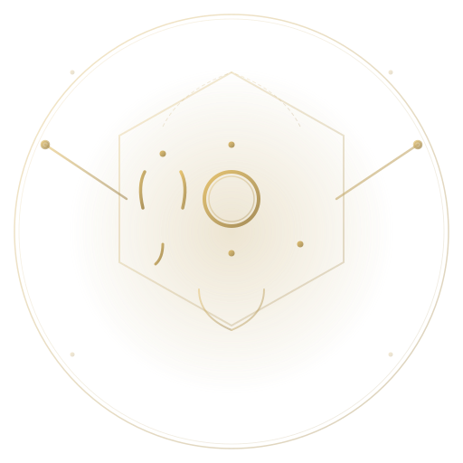

# Cy·Ph·Ai Logo Design Guide

## Overview

The **Cy·Ph·Ai** logo is an elegant, minimalist symbol representing Cyber-Physical AI through three interconnected Greek letters combined with robot aesthetic elements.

### Design Philosophy

- **Ψ (Psi)** — Left chamber: Consciousness, mind, cognitive processes
- **Φ (Phi)** — Center chamber: Golden ratio, harmony, fundamental proportions  
- **Ι (Iota)** — Right chamber: Minimal but significant, the smallest unit with impact
- **Robot Arms** — Mechanical effectors extending outward for action and control
- **Circuit Aesthetic** — Corner nodes and energy flow lines representing interconnected systems
- **Bronze/Gold Color** — Warmth and sophistication in otherwise dark/technical aesthetic

## Files Included

### 1. **cyph-ai-logo.svg** (Symbol Only)
- Pure symbol without text
- Scalable to any size
- Best for: favicon, icon usage, app interfaces, badges
- Viewbox: 512×512 (square format)

### 2. **cyph-ai-logo-text.svg** (With Label)
- Includes "Cy·Ph·Ai" text and subtitle
- Professional presentation
- Best for: branding, presentations, documents, headers
- Viewbox: 512×570 (portrait format with text space)

### 3. **favicon.svg** (Current Website Favicon)
- Optimized small version for browser tabs
- Same design as logo symbol

## Usage Guidelines

### Color
- **Primary:** Bronze/Gold gradient (`#E6C371` to `#A68D58`)
- **Background:** Dark (`#09090D` recommended)
- **Accent:** Cyan glow for energy representation

### Sizes & Applications

| Use Case | Size | Format | File |
|----------|------|--------|------|
| Favicon | 32×32px | SVG | favicon.svg |
| App Icon | 64×64px | SVG | cyph-ai-logo.svg |
| Social Media Avatar | 200×200px | SVG | cyph-ai-logo.svg |
| Header Logo | 300×300px | SVG | cyph-ai-logo-text.svg |
| Presentation Slide | 400×400px | SVG | cyph-ai-logo.svg |
| Print (High Res) | 2000×2000px+ | SVG | cyph-ai-logo.svg |
| Business Card | 400×300px | SVG | cyph-ai-logo-text.svg |

### Integration Tips

1. **Web Embedding**
   ```html
   
   ```

2. **CSS Background**
   ```css
   .header {
     background-image: url('cyph-ai-logo.svg');
     background-size: contain;
     background-repeat: no-repeat;
   }
   ```

3. **Export to Other Formats**
   - SVG → PNG: Use browser "Save as" or any vector editor
   - SVG → PDF: Use Inkscape or browser print-to-PDF
   - SVG → AI: Use Adobe Illustrator (File > Open)

## Design Elements Explained

### Chambers (Greek Letters)
The three vertical chambers form the core structure:
- Left: Psi's characteristic forked top
- Center: Phi's iconic circle bisected by vertical line
- Right: Iota's simple minimalist stem with serifs

### Mechanical Details
- **Robot arms:** Extend at angles representing action and control
- **Circuit nodes:** Small circles at endpoints representing information nodes
- **Energy flows:** Dashed lines showing connectivity between elements
- **Outer hexagon:** Geometric frame suggesting structural stability

### Color Gradient
The bronze-to-gold gradient:
- Suggests warmth and value (like gold)
- Works on dark backgrounds (WCAG AA compliant)
- Maintains elegance in grayscale (monochrome capable)

## Variations

### Monochrome (Black on Light Background)
Simply change the gradient fill to `#333333` or `#000000`

### Inverted (Light on Dark Background)
Already optimized for this — adjust to `#F4F1EB` for your light accent color

### Animated Version
SVG allows for subtle animations:
- Circle pulse in center Phi chamber
- Energy line animation along robot arms
- Gentle rotation of the whole symbol

## Recommended Contexts

✅ **Perfect For:**
- Academic papers and CV
- Research institution headers
- Product branding (AI/robotics)
- Conference presentations
- LinkedIn/Twitter profiles
- Lab/research group identity
- Tech company branding

❌ **Less Suitable For:**
- Extremely small sizes (<32px) — use favicon.svg instead
- Highly colorful backgrounds — maintain contrast
- Comic sans environments (kidding... but keep typography professional)

## Typography Pairing

The logo pairs well with:
- **Display:** Space Grotesk (geometric, modern)
- **Body:** Inter (clean, readable)
- **Mono:** DM Mono (technical, precise)

These match your website's existing typography system!

## Technical Specifications

- **Format:** SVG (Scalable Vector Graphics)
- **License:** Your personal use (part of egavves.com branding)
- **Transparency:** Yes (alpha channel supported)
- **Color Space:** sRGB (web-optimized)
- **Accessibility:** High contrast meets WCAG AA standards

---

**Created for:** Efstratios Gavves — Professor of Physical AI  
**Concept:** Cyber-Physical AI (Ψ·Φ·Ι)  
**Style:** Minimal, elegant, robot aesthetic with bronze accents
